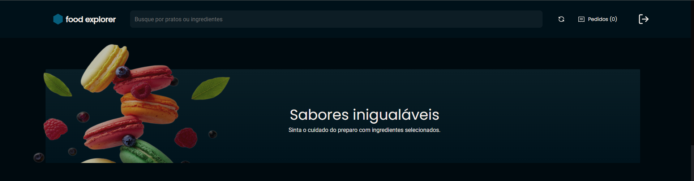
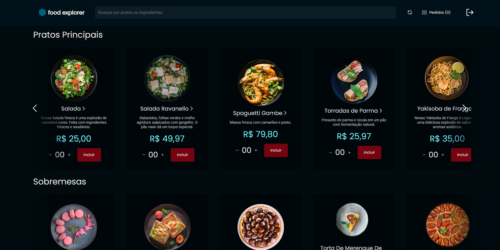

<p align="center">
  <h1 align="center"><a href="https://rocketfoodexplorersab.netlify.app/">Food Explorer - Rocketseat Explorer :rocket: </a></h1>
</p>

## 💻 Sobre
Este é o resultado do desafio final do Explorer, o Food Explorer.  
Nele realizei a criação do FrontEnd e do BackEnd completo da aplicação.
O Food Explorer é uma aplicação fictícia de restaurante que permite aos usuários explorar um menu dinâmico de pratos deliciosos. Abaixo você encontrará informações sobre as funcionalidades, a estrutura do projeto e como executá-lo.

___

## 🎨 Layout
A página inicial em formato desktop é vista na imagem abaixo:

<p align="center">
  
</p>
<p align="center">
  
</p>

<br>

# 🛠️ Funcionalidades:

## Perfil - User
Nesta plataforma, os usuários têm a capacidade de visualizar o menu de opções disponíveis. Para obter informações mais detalhadas sobre um prato específico, eles podem simplesmente clicar no nome desse prato. Ao fazer isso, uma descrição minuciosa e informativa do prato desejado estará imediatamente disponível, permitindo que os usuários acessem todos os detalhes relevantes antes de fazer sua escolha.

#### 👉 Aqui está um login de usuário base:
```bash
  e-mail: user@email.com
  senha: 123456
```

### Perfil - Admin
O Administrador possui um conjunto abrangente de permissões dentro do sistema. Isso inclui a capacidade de realizar alterações significativas relacionadas aos pratos disponíveis. Entre as suas funcionalidades, o administrador pode criar novos pratos, atualizar informações existentes e até mesmo excluir pratos do sistema conforme necessário. Além disso, o administrador pode acessar detalhes abrangentes sobre cada prato disponível, bastando clicar no nome de um prato específico. Essa funcionalidade permite ao administrador visualizar e gerenciar informações específicas de cada prato de forma eficiente.

#### 🔑 Quer ver como a aplicação funciona vista pelo Admin? Use a conta a seguir:

```bash
  e-mail: admin@email.com
  senha: 123456
```


## 🛠 Tecnologias

As seguintes tecnologias foram empregadas na criação deste projeto:

- [Axios](https://www.npmjs.com/package/axios)
- [BCryptjs](https://www.npmjs.com/package/bcryptjs)
- [CORS](https://www.npmjs.com/package/cors)
- [Express](https://expressjs.com)
- [JSON Web Token](https://www.npmjs.com/package/jsonwebtoken)
- [Javascript](https://developer.mozilla.org/pt-BR/docs/Web/JavaScript)
- [Knex](https://knexjs.org/)
- [Multer](https://www.npmjs.com/package/multer)
- [Node.js](https://nodejs.org/en/)
- [Nodemon](https://nodemon.io/)
- [React Icons](https://react-icons.github.io/react-icons/)
- [React Router Dom](https://react-icons.github.io/react-icons/)
- [ReactJs](https://reactjs.org)
- [SQLite](https://www.sqlite.org/index.html)
- [Styled Components](https://styled-components.com/)
- [Vite](https://vitejs.dev/)

___

#### 🚧 Como executar o backend localmente:
```bash
# Instale as dependências necessárias
$ npm install

# Agora inicie o servidor do BackEnd
$ npm run dev
```
___

#### 💻 Executando o FrontEnd localmente:
```bash
# Instale as dependências necessárias
$ npm install

# Agora inicie o servidor do FrontEnd
$ npm run dev
```

___
## 🖥️ Deploy

Este BackEnd foi hospedado diretamente no Render.  
Já o Frontend foi hospedado diretamente no Netlify.

[Este é o resultado final 🚀](https://rocketfoodexplorersab.netlify.app/)

